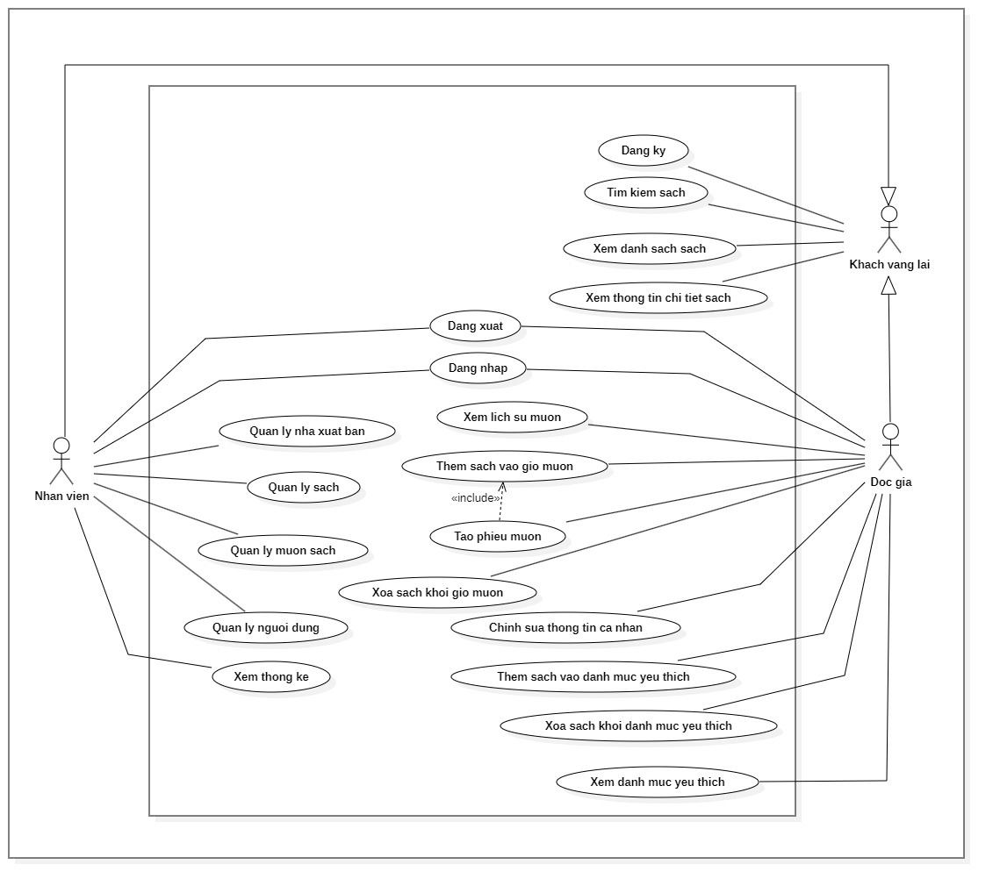
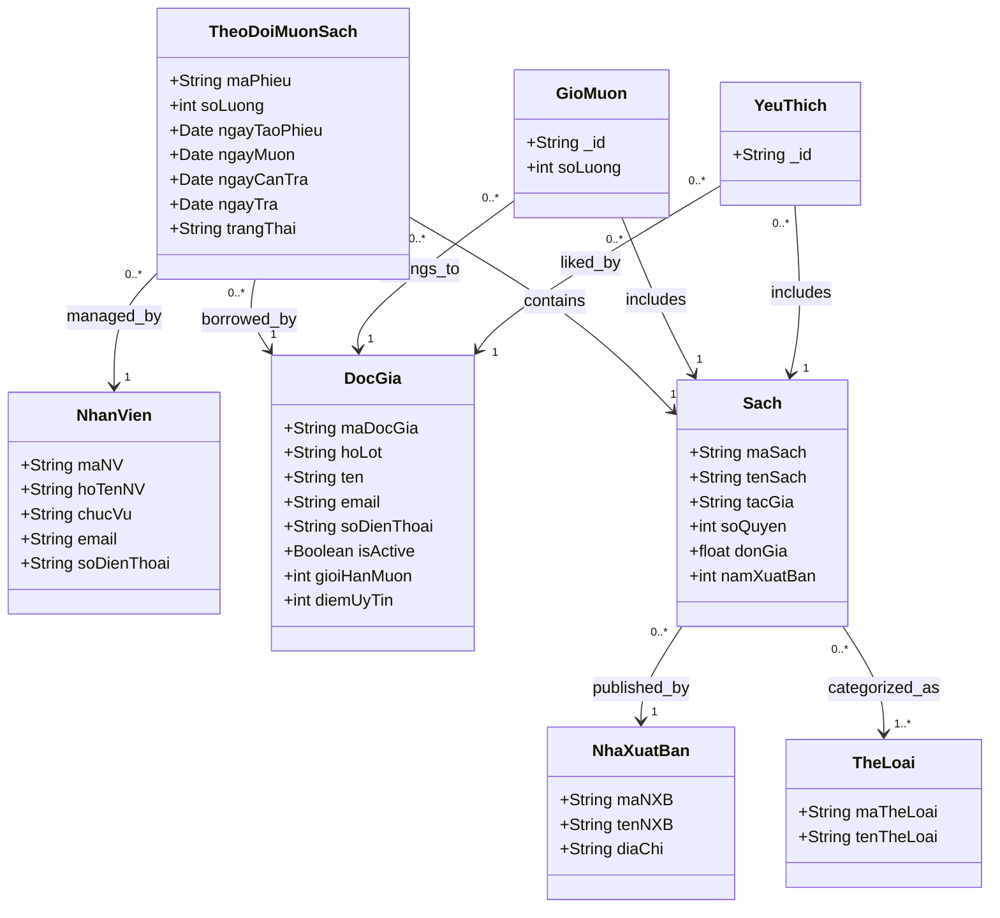

# LexiLibrary - Library Book Borrowing and Returning Management System

LexiLibrary is a web-based management system specifically designed to streamline the process of borrowing and returning books in libraries. Developed as a core project for the CT449 Web Development course, the application eliminates manual paperwork, minimizes processing delays, and ensures strict data integrity for all library operations.


## Table of Contents

- [System Overview](#system-overview)
- [Architecture and Diagrams](#architecture-and-diagrams)
- [Key Features](#key-features)
- [Technology Stack](#technology-stack)
- [Project Structure](#project-structure)
- [Installation and Setup](#installation-and-setup)

## System Overview

The application features role-based access control dividing functionalities among Guests, Registered Readers, and Library Staff. The core workflow encompasses automated stock validation during borrowing requests, validation of return timelines, and an overall optimization of the transactional loop between library clerks and readers.

The system utilizes a modern JavaScript monorepo architecture via pnpm workspaces to isolate the user interface from the backend database services efficiently.

## Architecture and Diagrams

GitHub renders these diagrams natively using Mermaid.js.

### 1. Use Case Diagram

The system handles distinct boundaries between non-authenticated users, active readers, and administrative staff managing the core borrowing loop.



### 2. Class Diagram (Database Schema)

The database and backend logic follow a highly structured entity relationship, tracking inventory counts, shopping carts, and transactional states of borrowing slips.



## Key Features

### Guests & Registered Readers

- **Authentication & Profile:** Seamless account registration, secure login, and personal profile management.
- **Catalog Exploration:** Advanced search capabilities, full catalog browsing, and detailed information viewing for every book.
- **Favorites System:** Curate a personalized reading list by adding or removing books from a dedicated favorites collection.
- **Borrowing Cart:** A flexible cart system allowing users to easily add or remove books before finalizing their request.
- **Borrowing Workflow:** Create formal borrowing slips directly from the cart and track the real-time status of personal borrowing history.

### Library Staff

- **Library Dashboard:** View comprehensive statistics and overviews of library operations and inventory metrics.
- **Catalog Management:** Full CRUD (Create, Read, Update, Delete) control over book inventory and publisher records.
- **Borrowing Processing:** Manage the entire lifecycle of reader borrowing slips, including approving, rejecting, and updating operational statuses (e.g., currently borrowing, returned).
- **Reader Administration:** Oversee the complete patron list with administrative authority to lock or manage specific reader accounts based on library policies.

## Technology Stack

### Frontend

- **Core Framework:** Vue 3 (Composition API)
- **Build System:** Vite
- **Component Library:** Element Plus
- **Functional Styles:** Tailwind CSS
- **State Framework:** Pinia
- **Client Routing:** Vue Router
- **Communication:** Axios (Configured with automated Request/Response interceptors)

### Backend

- **Execution Environment:** Node.js
- **Application Framework:** Express.js
- **Database Layer:** MongoDB (Implemented via the native MongoDB Driver)
- **Security:** JSON Web Tokens (JWT) for authentication state validation
- **Media Storage:** Cloudinary API

## Project Structure

```text
LEXILIBRARY/
├── backend/                # Express.js REST API Architecture
│   ├── app.js              # Server and Router configuration
│   ├── server.js           # API infrastructure entry point
│   └── .env                # Server configuration and secrets
├── frontend/               # Vue 3 Modular Application Single Page App
│   ├── src/                # Internal application source code
│   ├── public/             # Raw static assets
│   └── vite.config.js      # Build automation setup
├── documents/              # System execution screen proofs
├── pnpm-workspace.yaml     # Package workspace optimization mapping
└── README.md

```

## Installation and Setup

### Prerequisites

- Node.js (v18 or superior runtime)
- pnpm package manager installed globally
- Accessible MongoDB instance
- Configured Cloudinary asset cloud account

### 1. Repository Acquisition

```bash
git clone <your-repository-url>
cd LexiLibrary

```

### 2. Dependency Resolution

Initialize monorepo packages uniformly via the workspace root:

```bash
pnpm install

```

### 3. Backend Configuration

Navigate to the API module to organize runtime configurations:

```bash
cd backend
cp .env.example .env

```

Populate the newly generated `.env` template file with your specific configuration keys:

```env
PORT=3000
MONGODB_URI=YOUR_MONGODB_CONNECTION_STRING
CLOUDINARY_NAME=YOUR_CLOUDINARY_CLOUD_NAME
CLOUDINARY_KEY=YOUR_CLOUDINARY_API_KEY
CLOUDINARY_SECRET=YOUR_CLOUDINARY_API_SECRET
CLOUDINARY_ENV=YOUR_CLOUDINARY_URL
JWT_SECRET=YOUR_SECURE_JWT_SECRET

```

### 4. Database Initialization

Execute the seeding workflow to set up structural categories, test publishers, foundational books, and default administrative profiles:

```bash
node backend/seed.js

```

### 5. Executing Environment Instantiations

Both layers must run concurrently for functional operations.

**Run Backend API Gateway Server:**

```bash
cd backend
pnpm start

```

The application endpoints bind onto `http://localhost:3000`.

**Run Frontend Client Server:**

```bash
cd frontend
pnpm run dev

```

The client dashboard initiates at `http://localhost:5173`.
